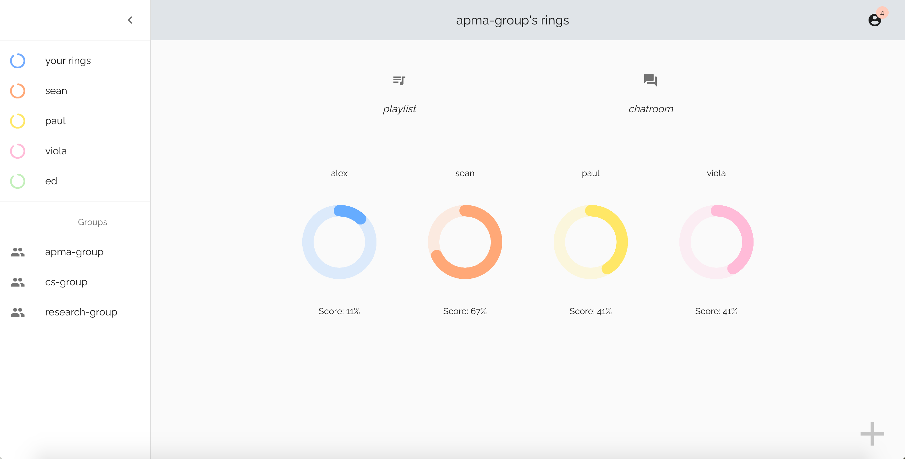

# Rings
Modern Cooperative Time Management Checklist with Rings Visualization 

## About 
The checklist has been around for millennia and it is about time that it was reinvented for the modern-day! The old checklist is only available to one person, and can no longer efficiently function under today’s increasingly connected society. A cooperative checklist with a visual representation of information is urgently needed. 

Our app, Rings, presents all your tasks in an easy-to-view visualization with rings that keep deadlines in focus. As deadlines for a certain task approach, its ring shortens. With just a quick glance, you can keep you and your team hyper-aware and on task. Rings is unique in its social aspect - what we offer is a collaborative solution to time management. You can allow friends to view some of your tasks so that you get a friendly reminder instead of an easy-to-dismiss notification. 

## Sneak Peak 
### the dashboard of all your rings


### the detail info for each of your circles


### viewing your friend's ring


### working in a group to manage tasks together


### chat with each other using the chat function


### vive to the same mood with your group


## Usage
to lauch the app on your localhost:
```
npm install
npm start
```

## More Info
For more info about this project, please see [this](https://devpost.com/software/rings) Devpost link. 
